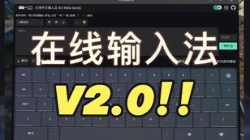

<!-- Improved compatibility of back to top link: See: https://github.com/othneildrew/Best-README-Template/pull/73 -->
<a id="readme-top"></a>

<!-- PROJECT LOGO -->
<br />
<div align="center">
  <a href="https://github.com/zhou9110/vr_pinyin">
    
  </a>

<h3 align="center">VRIME</h3>

  <p align="center">
    为VR设备(Meta Quest)设计的<br/>
    在线中文输入法
    <br />
    <a href="https://github.com/zhou9110/vr_pinyin"><strong>Explore the docs »</strong></a>
    <br />
    <br />
    <a href="https://vrime.org/">View Site</a>
    &middot;
    <a href="https://github.com/zhou9110/vr_pinyin/issues/new?labels=bug&template=bug-report---.md">Report Bug</a>
    &middot;
    <a href="https://github.com/zhou9110/vr_pinyin/issues/new?labels=enhancement&template=feature-request---.md">Request Feature</a>
  </p>
</div>

站点链接: <https://vrime.org/>

<!-- PROJECT SHIELDS -->
<!--
*** I'm using markdown "reference style" links for readability.
*** Reference links are enclosed in brackets [ ] instead of parentheses ( ).
*** See the bottom of this document for the declaration of the reference variables
*** for contributors-url, forks-url, etc. This is an optional, concise syntax you may use.
*** https://www.markdownguide.org/basic-syntax/#reference-style-links
-->
[![Contributors][contributors-shield]][contributors-url]
[![Forks][forks-shield]][forks-url]
[![Stargazers][stars-shield]][stars-url]
[![Issues][issues-shield]][issues-url]
[![project_license][license-shield]][license-url]
[](https://app.netlify.com/sites/vr-pinyin/deploys)

<!-- ABOUT THE PROJECT -->
## 关于本项目 About The Project

[![VRIME Screen Shot][product-screenshot]](https://vrime.org)

本项目重点改善一个问题：

> Meta Quest一体机没有自带中文输入法，首次使用的中文用户没法方便地输入中文

项目介绍视频（点击图片跳转至B站）：
[](https://www.bilibili.com/video/BV1iMASeaE8d/)

链接：[【Q2/3/3S】在线中文输入法网站 2.0正式发布！都更新了哪些内容？](https://www.bilibili.com/video/BV1iMASeaE8d/)

<p align="right">(<a href="#readme-top">back to top</a>)</p>

### 技术栈 Built With

* [![Vue][Vue.js]][Vue-url]
* [![Vite][Vite]][Vite-url]
* 基于项目 [My RIME 梧桐输入法](https://github.com/LibreService/my_rime) 改造

<p align="right">(<a href="#readme-top">back to top</a>)</p>

<!-- GETTING STARTED -->
## 开始使用 Getting Started

如果需要在本地运行，可以在 Release 页面下载打包后的文件，后续可以自行部署至任意服务器

(待补充)

<!-- ROADMAP -->
## 功能路线 Roadmap

* [x] 语音输入
* [ ] 模糊音设置
* [ ] 九键输入
* [ ] 键盘按键增加额外键位提示（例如五笔键位）
* [ ] 文档：介绍如何自行部署
* [ ] 文档：功能介绍
* [ ] Github Action 自动创建 Release

See the [open issues](https://github.com/zhou9110/vr_pinyin/issues) for a full list of proposed features (and known issues).

<p align="right">(<a href="#readme-top">back to top</a>)</p>

<!-- CONTRIBUTING -->
## 贡献本项目 Contributing

开源社区之所以能成为一个绝佳的学习、启发和创造的平台，离不开社区里每一位贡献者的努力。我们会非常感激您对项目做的任何贡献。

如果您有改进建议，欢迎 fork 本仓库并提交 pull request。
您还可以创建一个带有 "enhancement" 标签的 issue。
另外如果您喜欢本项目，别忘了为项目点个星标！再次感谢！:D

1. Fork 本项目
2. 创建功能分支（`git checkout -b feature/AmazingFeature`）
3. 提交修改（`git commit -m 'Add some AmazingFeature`）
4. 推送到远程分支（`git push origin feature/AmazingFeature`）
5. 发起 Pull Request

-----

Contributions are what make the open source community such an amazing place to learn, inspire, and create. Any contributions you make are **greatly appreciated**.

If you have a suggestion that would make this better, please fork the repo and create a pull request. You can also simply open an issue with the tag "enhancement".
Don't forget to give the project a star! Thanks again!

1. Fork the Project
2. Create your Feature Branch (`git checkout -b feature/AmazingFeature`)
3. Commit your Changes (`git commit -m 'Add some AmazingFeature'`)
4. Push to the Branch (`git push origin feature/AmazingFeature`)
5. Open a Pull Request

<p align="right">(<a href="#readme-top">back to top</a>)</p>

### Top contributors

<a href="https://github.com/zhou9110/vr_pinyin/graphs/contributors">
  
</a>

<!-- LICENSE -->
## 项目开源许可 License

本项目基于 AGPLv3+ 许可发行，请参考 `LICENSE` 文件了解详情。

Distributed under the AGPLv3+. See `LICENSE` for more information.

<p align="right">(<a href="#readme-top">back to top</a>)</p>

<!-- CONTACT -->
## 联系作者 Contact

David Zhou - [Bilibili: 贴纸菌](https://space.bilibili.com/627876)

Project Link: [https://github.com/zhou9110/vr_pinyin](https://github.com/zhou9110/vr_pinyin)

<p align="right">(<a href="#readme-top">back to top</a>)</p>

## 支持作者 Support

[](https://ko-fi.com/O4O515LV4N)

<!-- ACKNOWLEDGMENTS -->
## 致谢 Acknowledgments

* [My RIME 梧桐输入法](https://github.com/LibreService/my_rime)
* [RIME | 中州韻輸入法引擎](https://rime.im/)
* [Simple Keyboard](https://github.com/hodgef/simple-keyboard)

<p align="right">(<a href="#readme-top">back to top</a>)</p>

<!-- MARKDOWN LINKS & IMAGES -->
<!-- https://www.markdownguide.org/basic-syntax/#reference-style-links -->
[contributors-shield]: https://img.shields.io/github/contributors/zhou9110/vr_pinyin.svg?style=for-the-badge
[contributors-url]: https://github.com/zhou9110/vr_pinyin/graphs/contributors
[forks-shield]: https://img.shields.io/github/forks/zhou9110/vr_pinyin.svg?style=for-the-badge
[forks-url]: https://github.com/zhou9110/vr_pinyin/network/members
[stars-shield]: https://img.shields.io/github/stars/zhou9110/vr_pinyin.svg?style=for-the-badge
[stars-url]: https://github.com/zhou9110/vr_pinyin/stargazers
[issues-shield]: https://img.shields.io/github/issues/zhou9110/vr_pinyin.svg?style=for-the-badge
[issues-url]: https://github.com/zhou9110/vr_pinyin/issues
[license-shield]: https://img.shields.io/github/license/zhou9110/vr_pinyin.svg?style=for-the-badge
[license-url]: https://github.com/zhou9110/vr_pinyin/blob/master/LICENSE.txt
[product-screenshot]: public/screenshot.png
[Vue.js]: https://img.shields.io/badge/Vue.js-35495E?style=for-the-badge&logo=vuedotjs&logoColor=4FC08D
[Vue-url]: https://vuejs.org/
[Vite]: https://img.shields.io/badge/Vite-646CFF?style=for-the-badge&logo=Vite&logoColor=white
[Vite-url]: https://vite.dev


----

以下是原项目的文档（待合并）

Online Chinese IME powered by [My RIME](https://github.com/LibreService/my_rime) and [RIME](https://github.com/rime/librime).

This is a **STATIC** website so you **DON'T** need to own a server to host it.

All computation is performed in browser, thanks to Web Assembly.

It's also a [PWA](https://web.dev/progressive-web-apps/), so you can install it like a native App and use it **OFFLINE**.

## Documentation

If you want to distribute your own IME, see [customize](doc/customize.md).

If you want to deploy schemas dynamically (online, like how you deploy in Desktop/Mobile platforms), see [deploy](doc/deploy.md).

If you want to develop My RIME or know technical details, see [develop](doc/develop.md).

## Self host

Download latest [artifact](https://github.com/LibreService/my_rime/releases/download/latest/my-rime-dist.zip) built by GitHub Actions.

## Development workflow

My RIME can be built on Linux, macOS and Windows.

### Install node

You may use [nvm](https://github.com/nvm-sh/nvm)
or [winget](https://github.com/microsoft/winget-cli)
to install node.

### Install pnpm and dev dependencies

```sh
npm i -g pnpm
pnpm i
```

### Install build and RIME dependencies

```sh
# Ubuntu
apt install -y \
  cmake \
  ninja-build \
  clang-format \
  libboost-dev \
  libboost-regex-dev \
  libyaml-cpp-dev \
  libleveldb-dev \
  libmarisa-dev \
  libopencc-dev

# macOS
brew install cmake ninja clang-format

# Windows
winget install cmake Ninja-build.Ninja LLVM
```

### Install emsdk

<https://emscripten.org/docs/getting_started/downloads.html>

### Get submodule

It's not recommended to clone recursively, as many boost libs are not needed.

```sh
pnpm run submodule
```

### Get font

Uncommon characters are rendered using
[遍黑体](https://github.com/Fitzgerald-Porthmouth-Koenigsegg/Plangothic-Project),
[花园明朝](https://github.com/max32002/max-hana)
and
[一点明朝](https://github.com/ichitenfont/I.Ming).

```sh
pnpm run font
```

### Build wasm

```sh
pnpm run native
pnpm run schema
export ENABLE_LOGGING=OFF # optional, default ON
export BUILD_TYPE=Debug # optional, default Release
pnpm run lib
pnpm run wasm
```

### Run develop server

```sh
pnpm run dev
```

The app is accessible at <http://localhost:5173>

Optionally, go to <http://localhost:5173/?debug=on> or turn on `Advanced` switch so that you can send raw key sequences to librime,
e.g. `{Shift+Delete}`, `{Release+a}`.
This feature is better used with log enabled.

### Lint

```sh
pnpm run lint:fix
```

### Check type

```sh
pnpm run check
```

### Build

```sh
pnpm run build
```

### Test

```sh
pnpm run test
```

### Preview

```sh
pnpm run preview
```

### Deploy (maintainer only)

```sh
# publish IMEs
declare -a packages=(
  ... # targets output by pnpm run schema
)
for package in "${packages[@]}"; do
  pushd public/ime/$package
  npm publish
  popd
done

# set VERSION to avoid CDN and browser caching old version
export LIBRESERVICE_CDN=https://cdn.jsdelivr.net/npm/@libreservice/my-rime@VERSION/dist/
export RIME_CDN=https://cdn.jsdelivr.net/npm/@rime-contrib/

vercel build --prod
npm publish
vercel deploy --prebuilt --prod
```

## Docker

```sh
docker build \
  --build-arg ENABLE_LOGGING=OFF \
  -t my-rime .
docker run --name my-rime -d my-rime
```

Let's say the IP address of the container is 172.17.0.2 (got by `docker inspect my-rime | grep IPAddress`), then My RIME is accessible at <http://172.17.0.2/>.

<p align="right">(<a href="#readme-top">back to top</a>)</p>